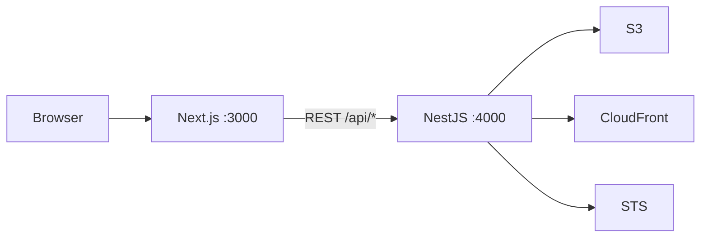

# S3Lens

Personal S3 + CloudFront manager. AWS is the source of truth — there is no database. Access keys stay on the NestJS server; the Next.js UI never receives them.

Use it locally to create buckets, browse prefixes, upload files, and copy CloudFront URLs. Each **new** bucket gets its own Origin Access Control and distribution. Existing distributions (including the portfolio one, `E2UQU0UOULG978`) are never given extra origins.

## Architecture



| App | Stack | URL |
| --- | --- | --- |
| Frontend | Next.js 16, App Router, Tailwind v4 | [http://localhost:3000](http://localhost:3000) |
| Backend | NestJS 11, Express, AWS SDK v3 | [http://localhost:4000](http://localhost:4000) |
| API docs | Swagger UI | [http://localhost:4000/api/docs](http://localhost:4000/api/docs) |

## What you can do

- List account buckets and the CloudFront distribution (if any) whose origin matches each bucket
- Create a bucket in `DEFAULT_BUCKET_REGION` with Block Public Access, a dedicated OAC, and an HTTPS-only distribution
- Open a bucket and browse folders via `?prefix=`
- Upload files (server timestamps the key), create folder markers, preview images, copy the CloudFront URL, delete files and folders
- Delete an **empty** bucket and disable its distribution — blocked for names in `PROTECTED_BUCKETS`

## Prerequisites

- Node.js 20+
- An AWS IAM user or role in the same account as the buckets you manage

## Setup

1. Copy [backend/.env.example](backend/.env.example) to `backend/.env` and set `AWS_ACCESS_KEY_ID` / `AWS_SECRET_ACCESS_KEY`.
2. Copy [frontend/.env.example](frontend/.env.example) to `frontend/.env.local` if it is missing. The default API URL is `http://localhost:4000`.

### Backend env

| Variable | Default | Purpose |
| --- | --- | --- |
| `AWS_REGION` | `ap-south-1` | Region for the default S3/STS clients |
| `AWS_ACCESS_KEY_ID` | — | IAM access key |
| `AWS_SECRET_ACCESS_KEY` | — | IAM secret |
| `HOST` | `localhost` | Listen address. Loopback by default; set `0.0.0.0` only for LAN access |
| `PORT` | `4000` | Nest listen port |
| `CORS_ORIGIN` | `http://localhost:3000` | Allowed browser origin |
| `DEFAULT_BUCKET_REGION` | `ap-south-1` | Region used when creating buckets |
| `PROTECTED_BUCKETS` | `kuldeepsinhjhala-portfolio-prod-s3` | Comma-separated names that cannot be deleted |
| `MAX_UPLOAD_BYTES` | `26214400` (25 MB) | Multer file size limit |

### Frontend env

| Variable | Default | Purpose |
| --- | --- | --- |
| `NEXT_PUBLIC_API_URL` | `http://localhost:4000` | Nest origin (no trailing `/api`; the client already prefixes paths) |

## Run

Use two terminals.

```bash
cd backend
npm install
npm run start:dev
```

```bash
cd frontend
npm install
npm run dev
```

Then:

- [http://localhost:3000](http://localhost:3000) — bucket list
- `/bucket/<bucket-name>?prefix=` — file manager (prefix is the current folder)
- [http://localhost:4000/api/docs](http://localhost:4000/api/docs) — try the API

Backend unit tests: `cd backend && npm test`.

## How it behaves

- **Credentials** never leave the backend. The UI only calls `/api/*`.
- **New buckets** get their own OAC + distribution. S3Lens never adds an origin to an existing distribution.
- **Copy URL** is always `https://{cloudfront-domain}/{key}`, never an S3 REST URL. The domain comes from matching a distribution origin to the bucket.
- **Uploads** store `{prefix}{timestamp}-{filename}` where `timestamp` is `Date.now()` on the server.
- **Deletes** in the UI require typing the exact bucket, file, or folder name. The API still refuses to delete a bucket that contains objects, and refuses to delete a non-empty folder unless `recursive` is true.
- **Protected buckets** cannot be deleted from S3Lens. Object upload/delete in those buckets is still allowed.

## IAM

Least privilege for the features above:

**S3** — `ListAllMyBuckets`, `GetBucketLocation`, `CreateBucket`, `DeleteBucket`, `ListBucket`, `GetObject`, `PutObject`, `DeleteObject`, `PutBucketPolicy`, `PutBucketPublicAccessBlock`

**CloudFront** — `ListDistributions`, `CreateDistribution`, `GetDistribution`, `UpdateDistribution`, `DeleteDistribution`, `CreateOriginAccessControl`, `DeleteOriginAccessControl`

**STS** — `GetCallerIdentity` (account id for the bucket policy `AWS:SourceArn` condition)

## Safety

This is a local/personal tool. It has no login. The API binds to `localhost` so it is not reachable from other machines. Do not set `HOST=0.0.0.0` unless you intend LAN access. Keep `.env` out of git (the backend gitignore already excludes it).
