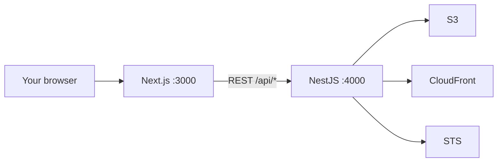

# S3Lens

A local app for managing your own Amazon S3 files through CloudFront URLs — without putting AWS keys in the browser, and without using the AWS Console for everyday work.

## The problem this repo solves

If you keep a personal website, portfolio, or documents in S3, day-to-day work is awkward:

- The **AWS Console** is built for cloud operations, not for “open this folder, drop a file, copy a public URL.”
- Files in a private bucket are not meant to be opened with a raw S3 URL. The public URL should come from **CloudFront**.
- Creating a bucket in the console does not automatically give you a **private bucket + CloudFront**. You still have to wire Origin Access Control, a distribution, HTTPS, and a bucket policy.
- It is easy to attach a new bucket as an extra origin on an **existing** distribution (for example a production portfolio CDN). That mixes sites and is hard to undo.
- Putting AWS keys in frontend code or a client-side SDK would leak them. Credentials must stay on a server you run.
- S3 has no real folders. A manager still needs folders, breadcrumbs, search, preview, and careful delete.

S3Lens is a **personal, on-your-machine** answer to that. AWS remains the source of truth (there is no database). You run a small NestJS API with your keys, and a Next.js UI that never sees those keys.

It is not a hosted SaaS. It has no login. It is meant to run on your computer.

## What you get

| App | What it is | Local URL |
| --- | --- | --- |
| Frontend | Next.js 16 (App Router, Tailwind) | [http://localhost:3000](http://localhost:3000) |
| Backend | NestJS 11 API (AWS SDK v3) | [http://localhost:4000](http://localhost:4000) |
| API docs | Swagger UI for every endpoint | [http://localhost:4000/api/docs](http://localhost:4000/api/docs) |



There are two screens:

- `/` — list of buckets
- `/bucket/<bucket-name>?prefix=` — file manager for one folder (`prefix` is the current path)

---

## Features

### Bucket home (`/`)

- Lists **every S3 bucket** in the AWS account those keys can see.
- For each bucket shows:
  - **Name**
  - **Region**
  - **CloudFront domain**, if S3Lens finds a distribution whose origin is that bucket
  - **Status** — Deployed, Provisioning, Disabling, or none
- **Create bucket** asks for a DNS-style name (lowercase, 3–63 characters). New buckets are always created in `DEFAULT_BUCKET_REGION` (default `ap-south-1`).
- Creating a bucket does more than `CreateBucket`. The API also:
  1. Turns on **Block Public Access** (the bucket is not world-readable via S3).
  2. Creates a **new** CloudFront Origin Access Control (OAC).
  3. Creates a **new** CloudFront distribution for that bucket only (HTTPS, GET/HEAD, OAC).
  4. Puts an S3 bucket policy so **only that distribution** can `s3:GetObject`.
- S3Lens **never adds an origin** to an existing distribution. Your production CDN (including `E2UQU0UOULG978`) is left alone.
- If CloudFront setup fails after the bucket exists, S3Lens tries to **delete the empty bucket** so you are not left with a half-created stack.
- **Open** goes to the file manager for that bucket.
- **Delete** only works on an **empty** bucket. You must type the exact bucket name. Names in `PROTECTED_BUCKETS` (default `kuldeepsinhjhala-portfolio-prod-s3`) cannot be deleted. After a successful delete, S3Lens disables the matching CloudFront distribution (full CloudFront delete only happens once AWS has finished disabling it).

### File manager (`/bucket/<name>?prefix=`)

- Header shows bucket name, region, CloudFront domain, and distribution status.
- **Breadcrumbs** (Home / images / …) are links. The current folder is stored in the URL as `?prefix=`, so you can bookmark or refresh.
- **Search this folder** filters the files and folders already on screen. It does not call S3. Clearing the box or opening another folder resets it. If the list is paginated, search only covers rows that have been loaded.
- **Folder** creates an S3 folder marker (a zero-byte object ending in `/`) under the current prefix.
- **Upload** opens a drop zone:
  - Drag-and-drop or browse
  - One file, up to **25 MB** (`MAX_UPLOAD_BYTES`)
  - Image thumbnail when you pick a picture
  - Optional **Save as** name
  - The **server** stores the object as `{prefix}{timestamp}-{filename}` so uploads do not overwrite each other. The timestamp is `Date.now()` on the API, not in the browser.
- The table lists folders then files, with type, size, and last modified.
- **Load more** fetches the next S3 page when a prefix has many keys.
- **Open** on a folder navigates with `?prefix=`.
- **View**
  - Images open in a centered preview
  - PDFs and videos can be previewed in the dialog
  - Other types offer an “open file” link when a CloudFront URL exists
- **Copy URL** copies the CloudFront URL (`https://{distribution-domain}/{key}`), never an `s3.amazonaws.com` URL. If the bucket has no matching distribution, there is nothing to copy.
- **Delete file** requires typing the exact file name (including the timestamp prefix shown in the table).
- **Delete folder** requires typing the exact folder name (including the trailing `/`). A non-empty folder is refused unless you confirm **recursive** delete. Recursive delete cannot target the whole bucket (a `/` or blank prefix is rejected).

### Rules that are always on

- AWS keys stay in `backend/.env`. The UI only talks to `/api/*`.
- Copy URL is always CloudFront, built on the server from the discovered distribution.
- Bucket names, prefixes, filenames, and object keys are validated (no `..`, no path tricks).
- The API listens on **localhost** by default, so other machines on the network cannot reach it.
- There is no login. Do not put this API on the public internet.

### API extras

- Swagger at `/api/docs` (same operations as the UI: health, buckets, objects, folders).
- Health check: `GET /api/health` → `{ "status": "ok" }`.

---

## Setup

You need:

- **Node.js 20+**
- An **AWS access key** for an IAM user or role in the same account as your buckets

### 1. Get the code

```bash
git clone https://github.com/kuldeepsinhjhala/S3Lens.git
cd S3Lens
```

### 2. Backend config

Copy the example env file and put your keys in:

```bash
cd backend
copy .env.example .env
```

On macOS/Linux use `cp .env.example .env`.

Open `backend/.env` and set at least:

```
AWS_ACCESS_KEY_ID=...
AWS_SECRET_ACCESS_KEY=...
```

Leave the rest as-is for a first run. Then:

```bash
npm install
npm run start:dev
```

The API should listen on [http://localhost:4000](http://localhost:4000). Swagger: [http://localhost:4000/api/docs](http://localhost:4000/api/docs).

### 3. Frontend config

In a second terminal:

```bash
cd frontend
copy .env.example .env.local
npm install
npm run dev
```

`.env.local` only needs:

```
NEXT_PUBLIC_API_URL=http://localhost:4000
```

(Do not add `/api` at the end. The client already prefixes paths.)

Open [http://localhost:3000](http://localhost:3000). You should see your buckets.

### 4. IAM permissions

The access key needs at least:

**S3** — `ListAllMyBuckets`, `GetBucketLocation`, `CreateBucket`, `DeleteBucket`, `ListBucket`, `GetObject`, `PutObject`, `DeleteObject`, `PutBucketPolicy`, `PutBucketPublicAccessBlock`

**CloudFront** — `ListDistributions`, `CreateDistribution`, `GetDistribution`, `UpdateDistribution`, `DeleteDistribution`, `CreateOriginAccessControl`, `DeleteOriginAccessControl`

**STS** — `GetCallerIdentity` (used to lock the bucket policy to your account’s distribution ARN)

### 5. Optional checks

```bash
cd backend
npm test
```

---

## Environment variables

### `backend/.env`

| Variable | Default | What it does |
| --- | --- | --- |
| `AWS_REGION` | `ap-south-1` | Region for the default S3 and STS clients |
| `AWS_ACCESS_KEY_ID` | — | IAM access key (required) |
| `AWS_SECRET_ACCESS_KEY` | — | IAM secret (required) |
| `HOST` | `localhost` | Address the API binds to. Keep `localhost`. Use `0.0.0.0` only if you really want LAN access |
| `PORT` | `4000` | API port |
| `CORS_ORIGIN` | `http://localhost:3000` | Browser origin allowed to call the API |
| `DEFAULT_BUCKET_REGION` | `ap-south-1` | Region used when **creating** a bucket |
| `PROTECTED_BUCKETS` | `kuldeepsinhjhala-portfolio-prod-s3` | Comma-separated bucket names that cannot be deleted in S3Lens (you can still upload/delete objects inside them) |
| `MAX_UPLOAD_BYTES` | `26214400` (25 MB) | Maximum upload size |

### `frontend/.env.local`

| Variable | Default | What it does |
| --- | --- | --- |
| `NEXT_PUBLIC_API_URL` | `http://localhost:4000` | Where the UI finds the API |

`.env` and `.env.local` are gitignored. Only `.env.example` files are in the repo.

---

## Project layout

```
S3Lens/
  README.md
  backend/     NestJS API — buckets, objects, folders, CloudFront, Swagger
  frontend/    Next.js UI — bucket cards and file manager
```

---

## Safety

- Run it on your own machine. It has **no authentication**.
- Do not expose port `4000` or Swagger to the internet.
- Do not commit `.env`.
- Treat `PROTECTED_BUCKETS` as a delete-guard only. Uploading to a production bucket can still change the live site.
- New CloudFront distributions take a few minutes to reach **Deployed**. Until then, copy URL may work while the CDN is still provisioning.
